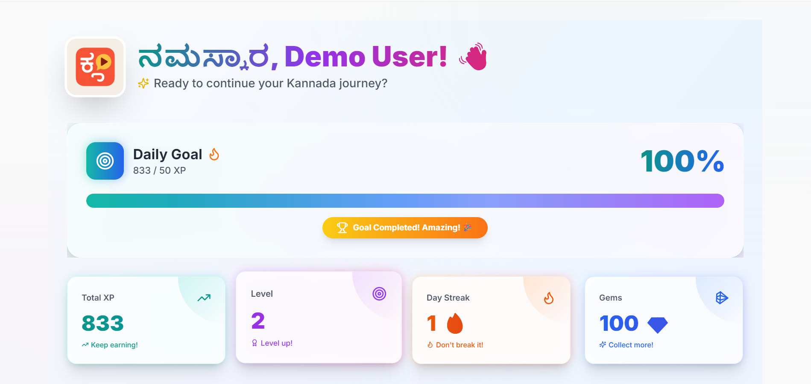
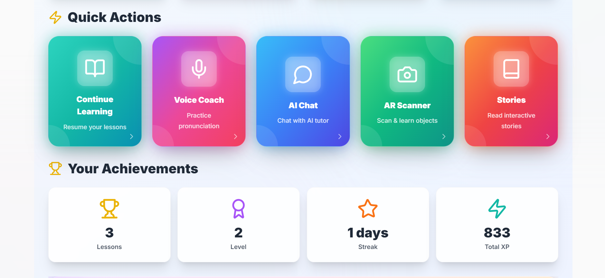

# 🎓 Kannada E-Learning Platform

A modern, AI-powered Kannada learning platform with gamification, voice recognition, AR object learning, and intelligent tutoring — built using **React**, **Node.js**, **MongoDB**, and **AI APIs**.

---

## 🖼️ Screenshots

- **Dashboard**  
  

- **Quick Actions**  
  

---

## ✨ Features

### 🔤 Language Learning
- Structured Kannada lessons
- Vocabulary builder
- Story-based learning

### 🎤 Voice Coach
- Real-time pronunciation scoring
- Browser-based speech recognition
- Instant feedback and accuracy percentage

### 🤖 AI Kannada Tutor
- Smart Kannada chatbot
- Translation support
- Grammar explanations

### 📸 AR Object Scanner
- Detects real-world objects via camera
- Learn Kannada words from objects

### 🏆 Gamification
- XP, levels, streaks
- Gems, badges, achievements
- Daily goals

### 📊 Analytics
- XP & streak tracking
- Lesson progress
- Personalized recommendations

---

## 🚀 Tech Stack

### **Frontend**
- React 18 + Vite
- Tailwind CSS
- Zustand
- Framer Motion
- Axios
- Lucide Icons

### **Backend**
- Node.js + Express
- MongoDB + Mongoose
- JWT Auth
- Socket.io
- Groq AI + Google Gemini APIs

---

## 📁 Project Structure

```
kannada-elearning/
├── frontend/
│   ├── src/
│   │   ├── components/
│   │   ├── pages/
│   │   ├── store/
│   │   ├── styles/
│   │   └── App.jsx
│   └── package.json
│
├── backend/
│   ├── controllers/
│   ├── models/
│   ├── routes/
│   ├── middleware/
│   ├── config/
│   └── server.js
│
├── screenshots/
│   ├── dashboard.jpg
│   └── quick-actions.jpg
│
└── README.md
```

---

## 🛠️ Installation & Setup

### 1️⃣ Clone the Repository
```bash
git clone https://github.com/your-username/kannada-elearning.git
cd kannada-elearning
```

---

# 🖥️ Backend Setup

### Install dependencies
```bash
cd backend
npm install
```

### Create `.env`
```
PORT=5000
MONGODB_URI=your_mongodb_uri_here
JWT_SECRET=your_jwt_secret_here
GROQ_API_KEY=your_groq_key_here
GEMINI_API_KEY=your_gemini_key_here
```

### Run backend
```bash
npm run dev
```

Backend URL:  
👉 **http://localhost:5000**

---

# 💻 Frontend Setup

### Install dependencies
```bash
cd ../frontend
npm install
```

### Create `.env`
```
VITE_API_URL=http://localhost:5000
VITE_GEMINI_API_KEY=your_key_here
```

### Start frontend
```bash
npm run dev
```

Frontend URL:  
👉 **http://localhost:5173**

---

## 🎮 How to Use

1. Sign Up / Login  
2. Explore Dashboard  
3. Use Quick Actions:
   - Continue Lessons  
   - Voice Coach  
   - AI Chat  
   - AR Scanner  
   - Stories  
4. Track XP, progress & streaks  
5. Learn Kannada daily!

---

## 🐛 Troubleshooting

### Voice Coach Fixes
- Use **Google Chrome**
- Allow microphone access
- Ensure SpeechRecognition API exists

### Backend Issues
- Check MongoDB running
- Verify `.env`
- Ensure port **5000** is free

### Frontend Issues
```
rm -rf node_modules
npm install
```
Restart browser + server.

---

## 🤝 Contributing
1. Fork this repo  
2. Create a new branch  
3. Commit changes  
4. Push & open PR  

---

## 📄 License
MIT License

---

## 👨‍💻 Author
**Your Name**  
GitHub — https://github.com/itsAcchu  
Email — harishreddy.workmail@gmail.com  

---

## ⭐ Support
If this project helped you, please ⭐ the repo!


